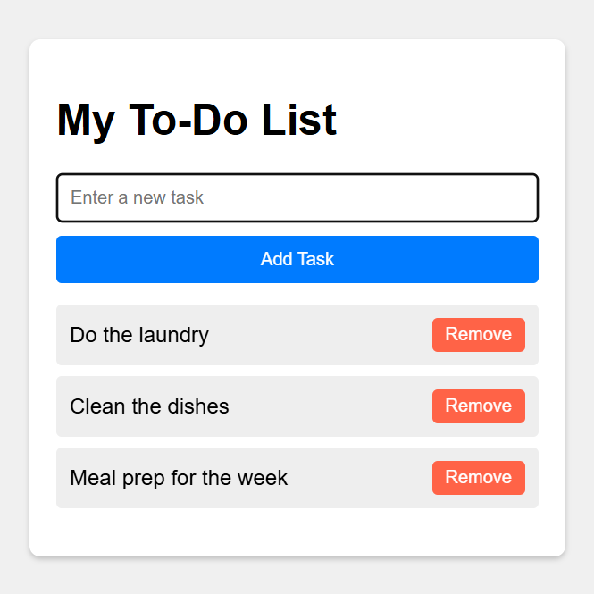

# ALX Dynamic To-Do List (JavaScript)

A lightweight, interactive To-Do List application built with vanilla JavaScript. This app allows users to add, display, and remove tasks dynamically using DOM manipulation techniques.

---

## 📚 Table of Contents

- [Preview](#preview)
- [Features](#features)
- [Tech Stack](#tech-stack)
- [How It Works](#how-it-works)
- [Folder Structure](#folder-structure)
- [Installation](#installation)
- [Testing](#testing)
- [Credits](#credits)
- [Contact](#contact)

---

## Preview



## Features

- Add tasks via button or pressing **Enter**
- Remove tasks individually
- Interactive DOM updates in real-time
- Keyboard accessibility supported

---

## Tech Stack


---

## How It Works

### DOMContentLoaded

All logic runs after the page fully loads using:

```js
document.addEventListener("DOMContentLoaded", () => { ... });
```

### Task Input

- Uses `getElementById()` to select inputs
- `addTask(`) handles validation, creation, and removal of list items

### Add/Remove Logic

- Tasks added with a `button` or pressing `Enter`
- Each task includes a `Remove button` with an event listener to delete the task

## Folder Structure

```plaintext
dynamic-to-do-list-js/
├── assets/
├── index.html
├── styles.css
├── script.js
└── README.md
```

## Installation

1. Clone this repository:

   ```bash
   git clone https://github.com/yourusername/dynamic-to-do-list-js.git
   ```

2. Navigate to the project directory:

   ```bash
   cd dynamic-to-do-list-js
   ```

3. Open `index.html` in your browser to run the app.

## Testing

- Add multiple tasks
- Try removing tasks
- Press Enter to add tasks
- Check empty input validatio

## Credits

- Project idea & structure inspired by [ALX](https://www.alxafrica.com/) exercises

## Contact

Made with ❤️ by **Mia Mudzingwa**

- GitHub: [Mia06-coder](https://github.com/Mia06-coder)
- LinkedIn: [mia-mudzingwa](https://www.linkedin.com/in/mia-mudzingwa)
